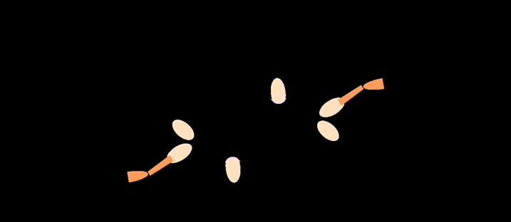
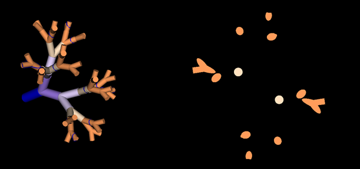
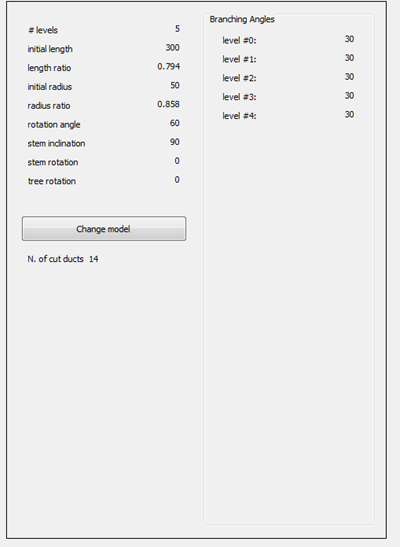

Introduction to Duct Modeler:
=======================
To showcase our mathematical model of breast ducts growth, we developed a 3d visualization 
software.  Our software allows the user to manipulate all the parameters of the model (see section: Parameters)
rotate, zoom, and slice the resulting structure at an arbitrary position.

Here we give a brief, high level overview of the software, the installation instructions, and some tips on usage.

Obtaining the Software:
=======================
The full source code can be obtained for free from [github](https://github.com/FedericoV "Github Repo") under a GPL license.
The software relies on [VTK](http://www.vtk.org/) libraries for 3d visualization, [Qt](http://qt-project.org/) for UI, and numpy for mathematical operations.

The easiest way to install all the dependencies is to use a scientific Python distribution such as
[Anaconda](https://store.continuum.io/cshop/anaconda/ "Anaconda") or [EPD](https://www.enthought.com/products/epd/ "Enthought Python Distribution") and then installing PyVTK and PyQT.

Alternatively, pre-compiled binaries are available from the website of the authors for OSX, Windows, and Linux.
Please report any issues installing the software and or bugs to Tommaso Schiavinotto and Federico Vaggi.

Modeling Approach:
==================
Here we give a brief outline of the modeling framework.  For an in-depth mathematical description, 
see **Materials and Methods** and the commented code on github.

We simulate the growth of the breast ducts as an idealized fractal tree using *l-systems*.  This 
mathematical formalism has been highly successful in describing plant growth of and other complex 
systems displaying multiple symmetries.  In our approach, we describe the breast ducts as a symmetric 
tree displaying a highly branching geometry.

Graphical User Interface:
=========================
The software is divided into three panels.  The tree view, in the upper left hand side, the slice view
in the bottom left hand side, and the control panel on the right hand side.

Tree View:
----------

The tree view shows the fully rendered fractal structure of the breast duct network.  Each level of the network is 
drawn using different colors, to aid in the visualization.  Using the mouse, it's possible to arbitrarily rotate the 
tree and to automatically zoom in and out of the tree.  Currently, our software does not impose steric constraints 
on duct growth, so for large branching angles and multiple generations, it's possible to have overlap between different
generations of branches.

Slice View:
-----------

Although there have been some incredibly striking advances in [3d imaging of ducts](http://www.nature.com/nature/journal/v506/n7488/abs/nature12948.html "3d Duct Imaging") by far the most widely used experimental technique to probe duct structure is through the analysis of multiple histological slices.

To aid in the comparison between our model and those assays, we have implemented an automatic 'slicer' whose position
can be controlled using the slider in the middle.

The slicer's position can be visualized in the tree view showing where the tree structure is being cut.  Note that the 
vertical position of the slicer can be controlled using the slider between the left and right pane.  The angle at which the 
tree is being sliced can also be changed directly.  Here for example we moved the position of the slicer further up on the tree,
increasing the number of branches that are cut (notice the position of the blue circles along the tree).

In the slicer view, we see a 2d section of the tree structure being cut.  Each different generation of branches is shown in the
same colors as those from the tree view.  We also display an approximate count of the number of sliced elements.  With higher 
branch density, it can be difficult to manually distinguish individual ducts in 2d sections.

Control Panel:
-------------

The control panel allows the user to change all parameters governing the geometry of the simulation.  Here is a brief description.
For a full description of the mathematical formalism, see **Materials and Methods**.

1.  **n_levels**: The number of levels of the the tree to render.  In general, any number higher than 15 will result in a highly over-lapping density

2.  **initial_length**: The length of the initial base of the tree (the stem)

3.  **initial_ratio**:  The radius of the initial base of the tree (the stem)

4.  **length_ratio**:  The ratio between the length of successive generations of branches

5.  **radius_ratio**:  The ratio between the radius of successive generations of branches

6.  **rotation_angle**:  The angle for which the plan of a branching is rotated with respect to the one of the previous generation, a rotation_angle of 0 creates a flat tree 

7.  **stem_inclination**: The inclination of the stem with respect with the horizontal plan, by default this value is 90, orthogonal to the plan, hence pointing upwards.

8.  **stem_rotation**: The rotation of the stem around the vertical axis. When the stem_inclination value is 90 this value is does not influence the tree construction

9.  **tree_rotation**: The rotation of the tree around the stem axis

Although the user can vary the parameters as they wish, some combinations will give rise to very unrealistic geometries, and 
rendering an excessive use of generations (30+) will typically cause a desktop machine to slow down massively.
